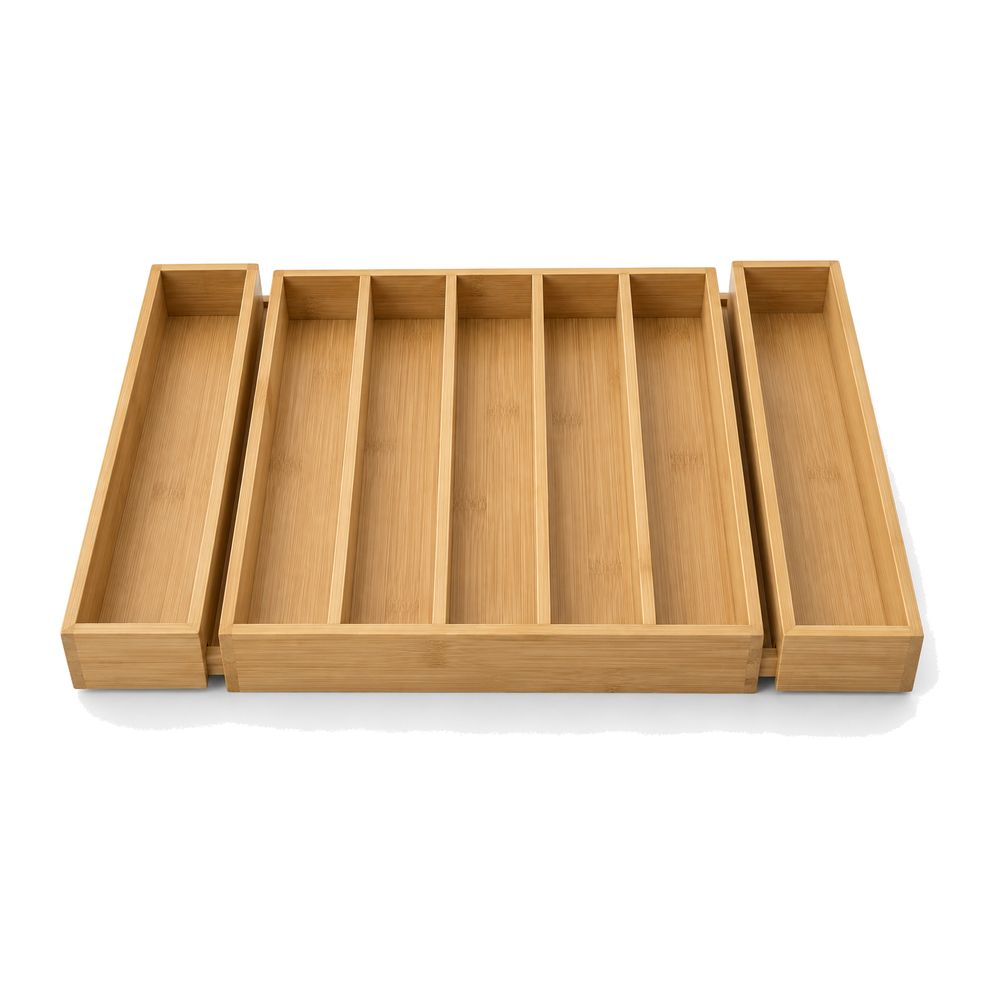
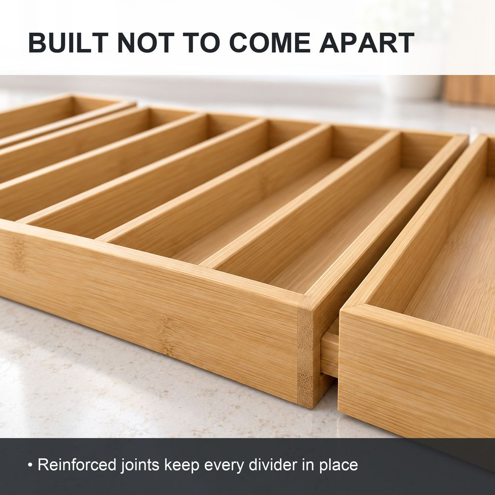
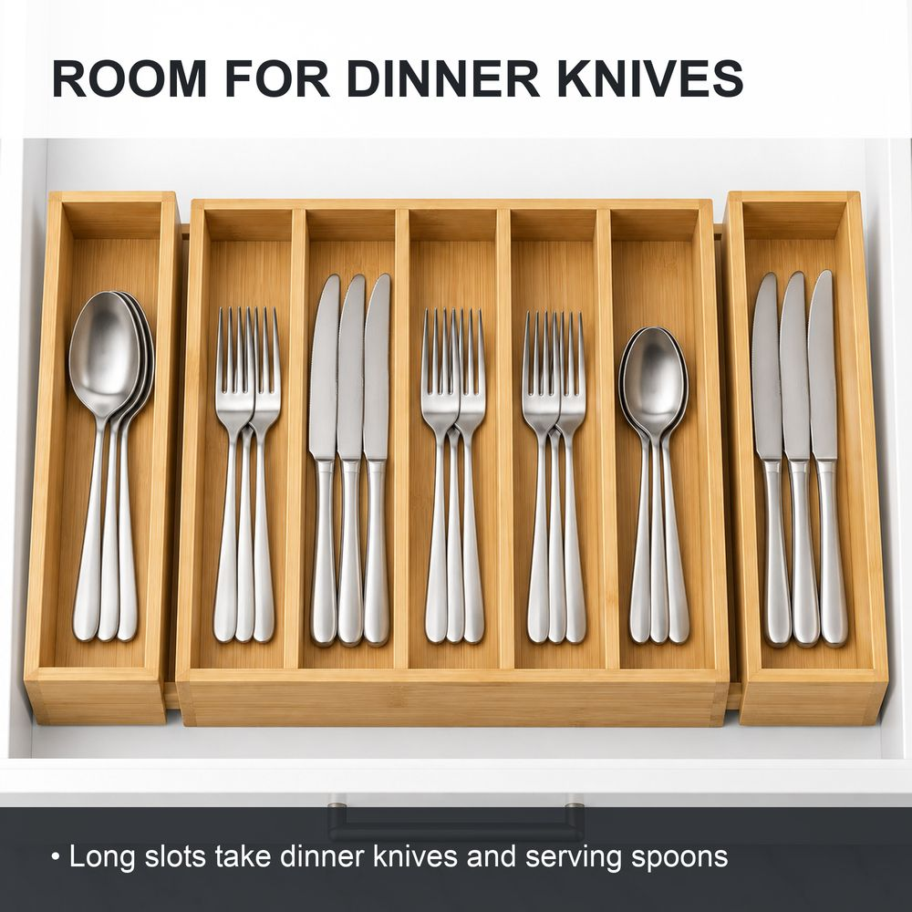
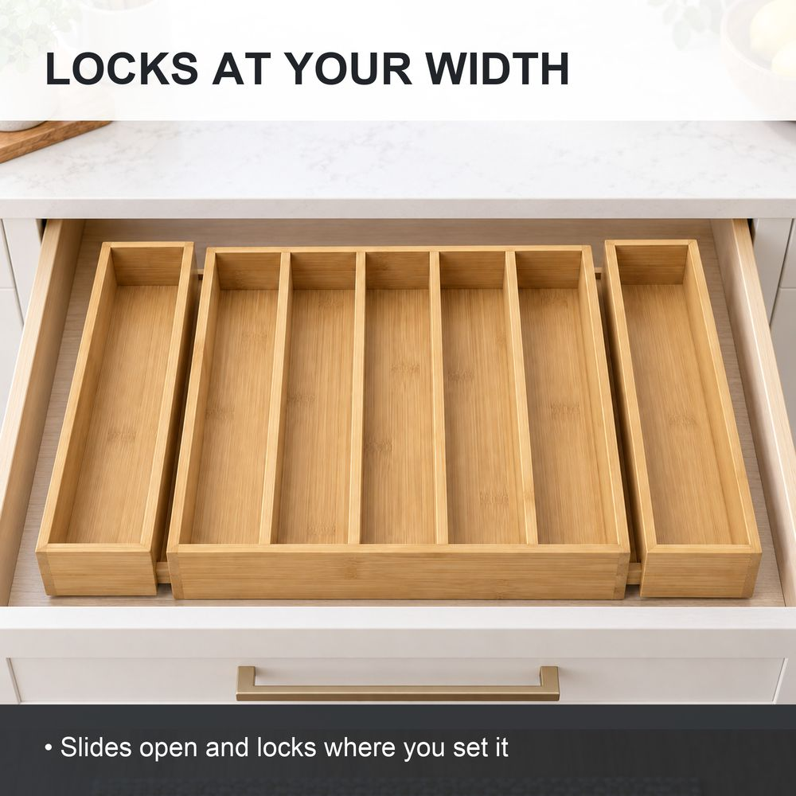
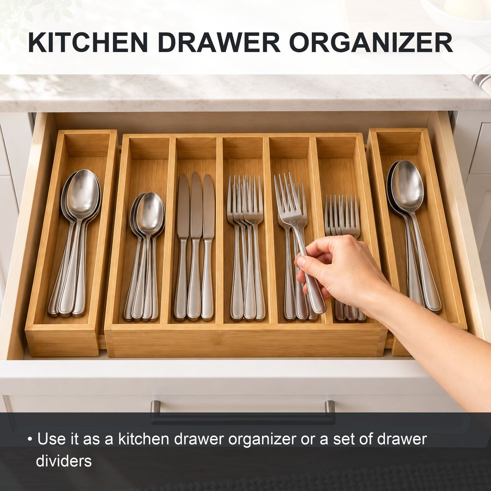
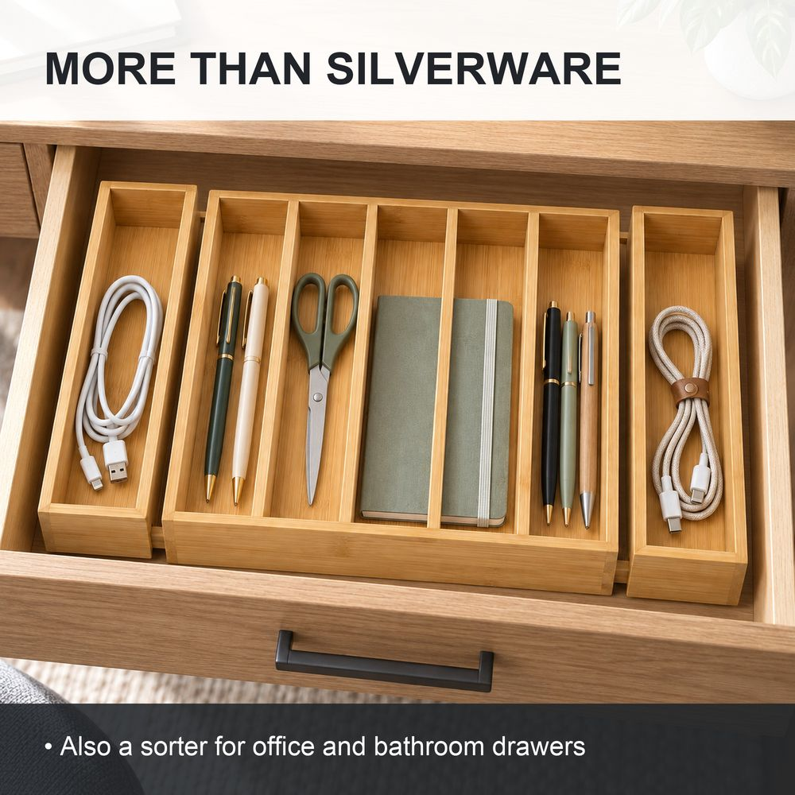

# S3 Listing · 图片

针对候选：C2
生成时间：2026-09-12 23:59
出图：本机 Codex CLI 自带 image_gen；文字由 images.py 排版，模型不写字

> ⚠️ **本套图基于 AI 概念参考图生成（没有实拍图），只用于演示方案，不能直接上架。** 拿到实拍图后放进 `产品图/` 重跑。

## 图位

| 图 | 图位 | 目的 | 依据 | 叠加文字 | 质检 |
|---|---|---|---|---|---|
|  | 01_main | 主图：白底实物 | 亚马逊主图规则（纯白、占比 ≥85%、无文字） | 无 | PASS |
|  | 02_sturdy | 头号关心点：结构结实 | 关心点：结构不结实 差评 12/20，对标只写泛泛的 tight assembly；五点 1 | BUILT NOT TO COME APART / Reinforced joints keep every divider in place | PASS |
|  | 03_knives | 第二关心点：放得下餐刀和整套餐具 | 关心点：放不下餐刀 C1 差评 8/14、槽太浅 C2 差评 3/20；五点 3 | ROOM FOR DINNER KNIVES / Long slots take dinner knives and serving spoons | PASS |
|  | 04_lock | 差异化：宽度可调并锁定 | 关心点：锁不住宽度（C2 差评、C3 需求点），对标没写；好评 9/20 因可伸缩购买；五点 2 | LOCKS AT YOUR WIDTH / Slides open and locks where you set it | PASS |
| — | 05_size | 尺寸 | 五点 2 的宽度范围 | 无 | HOLD：收起 / 展开宽度、长度、槽深均未确认（产品信息.md 未提供），不编数字 |
|  | 06_kitchen | 核心使用场景：厨房 | 五点 2；长描述场景 1 | KITCHEN DRAWER ORGANIZER / Use it as a kitchen drawer organizer or a set of drawer dividers | PASS |
|  | 07_more | 多用途：书桌抽屉 | 五点 5；长描述场景 3 | MORE THAN SILVERWARE / Also a sorter for office and bathroom drawers | PASS |

## 挂起（HOLD）与待补资料

- [ ] 05_size：收起 / 展开宽度、长度、槽深均未确认（产品信息.md 未提供），不编数字

## 质检明细

**01_main**：PASS
- ✅ 尺寸 2000×2000（2000×2000）
- ✅ 文件 ≤10MB（521KB）
- ✅ 主图边缘纯白 ≥99%（100.0%）
- ✅ 主图产品占比 ≥85%（长边）（88%）
- ✅ 主图无叠加文字
- ✅ 视觉质检通过（（5 条中槽 + 2 个侧盒与参考图一致；竹面有很淡的压印纹理，不构成可读文字；白底无道具））

**02_sturdy**：PASS
- ✅ 尺寸 2000×2000（2000×2000）
- ✅ 文件 ≤10MB（641KB）
- ✅ 叠加文字只用文案里已有的词、无〔待填〕
- ✅ 叠加文字无违禁宣传语
- ✅ 视觉质检通过（（接缝特写，结构与参考图一致；「加固接缝」工艺待供应商确认））

**03_knives**：PASS
- ✅ 尺寸 2000×2000（2000×2000）
- ✅ 文件 ≤10MB（675KB）
- ✅ 叠加文字只用文案里已有的词、无〔待填〕
- ✅ 叠加文字无违禁宣传语
- ✅ 视觉质检通过（（中间 5 槽、两侧侧盒都在；整把餐刀完整放进槽内））

**04_lock**：PASS
- ✅ 尺寸 2000×2000（2000×2000）
- ✅ 文件 ≤10MB（566KB）
- ✅ 叠加文字只用文案里已有的词、无〔待填〕
- ✅ 叠加文字无违禁宣传语
- ✅ 视觉质检通过（（侧盒拉开到最宽，结构一致；画面看不出锁定结构，锁定功能待供应商确认，做不到须删掉标题））

**06_kitchen**：PASS
- ✅ 尺寸 2000×2000（2000×2000）
- ✅ 文件 ≤10MB（704KB）
- ✅ 叠加文字只用文案里已有的词、无〔待填〕
- ✅ 叠加文字无违禁宣传语
- ✅ 视觉质检通过（（只出现手、无人脸，符合 P0 规定；右侧侧盒透视略怪，不影响识别））

**07_more**：PASS
- ✅ 尺寸 2000×2000（2000×2000）
- ✅ 文件 ≤10MB（839KB）
- ✅ 叠加文字只用文案里已有的词、无〔待填〕
- ✅ 叠加文字无违禁宣传语
- ✅ 视觉质检通过（（书桌抽屉场景，结构一致，无多余部件））

结论：全部通过
